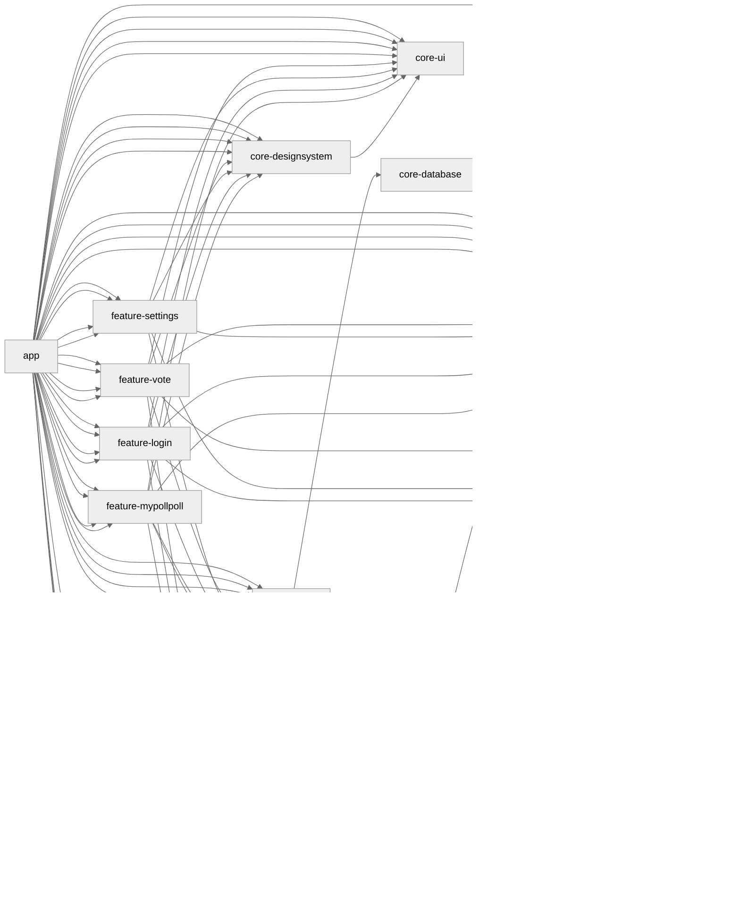

# pollpoll-android
3조 pollpoll android 앱입니다.

### Dependency Diagram

```mermaid
%%{
  init: {
    'theme': 'neutral'
  }
}%%

graph LR

  core-network --> core-testing
  core-network --> core-datastore
  core-network --> core-common
  core-designsystem --> core-ui
  feature-mypollpoll --> core-testing
  feature-mypollpoll --> core-data
  feature-mypollpoll --> core-ui
  feature-mypollpoll --> core-designsystem
  feature-mypollpoll --> core-model
  feature-mypollpoll --> core-common
  feature-login --> core-testing
  feature-login --> core-data
  feature-login --> core-ui
  feature-login --> core-designsystem
  feature-login --> core-common
  feature-login --> core-model
  feature-settings --> core-testing
  feature-settings --> core-data
  feature-settings --> core-ui
  feature-settings --> core-designsystem
  feature-settings --> core-common
  core-datastore --> core-testing
  core-datastore --> core-model
  feature-vote --> core-testing
  feature-vote --> core-data
  feature-vote --> core-model
  feature-vote --> core-ui
  feature-vote --> core-designsystem
  feature-vote --> core-common
  core-data --> core-database
  core-data --> core-datastore
  core-data --> core-network
  core-data --> core-model
  app --> core-testing
  app --> core-ui
  app --> core-data
  app --> feature-login
  app --> feature-vote
  app --> feature-mypollpoll
  app --> feature-settings
  app --> core-designsystem
  app --> core-common
  app --> core-model
  app --> core-ui
  app --> core-data
  app --> feature-login
  app --> feature-vote
  app --> feature-mypollpoll
  app --> feature-settings
  app --> core-designsystem
  app --> core-common
  app --> core-model
  app --> core-ui
  app --> core-data
  app --> feature-login
  app --> feature-vote
  app --> feature-mypollpoll
  app --> feature-settings
  app --> core-designsystem
  app --> core-common
  app --> core-model
  app --> core-ui
  app --> core-data
  app --> feature-login
  app --> feature-vote
  app --> feature-mypollpoll
  app --> feature-settings
  app --> core-designsystem
  app --> core-common
  app --> core-model

```